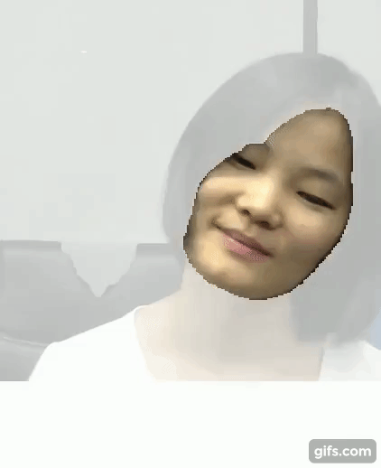

## Face Skin Segmentation 

  

Skin pixels have significant part in extraction of rPPG signal we trained first ever deep learning model for semantic 
segmentation of skin and non skin pixels. This is novel technique for regio of interst (ROI) selection and tracking. The model is robust to motion, multiple poses and segments skin pixels from non skin very accurately.
Waveform of rPPG signal is different when extracted from different rigion of skin pixels therefore to consistently sample ROI from same part of skin we detect face in frame as pre step to semantic segmentation.

Data was obtained and merged from multiple resources. Publiically available datasets are small. Therefore, obtained data from multiple resources and merged them. Tried multiple architecure (U-net, FCN, LinkNet34) for segmentation. LinkNet34 performs well for this small dataset.

## Requirements

* Python 3
* Numpy
* Pytorch
* OpenCv
* Matplotlib, Scipy, Pillow
* Jupyter
* Git Lfs to track trained model parameters
* We have used deep learning for semantic segmentation of skin and non skin pixels from frames. The segmentation requires cuda enabled device

Clone this repository.

        git clone https://github.com/nasir6/face-segmentation.git

To run

        To see a working demo download pretrained model using git-lfs
        It is recommended to run on cuda device to get real time performance. 
        Run "demo" jupyter notebook

